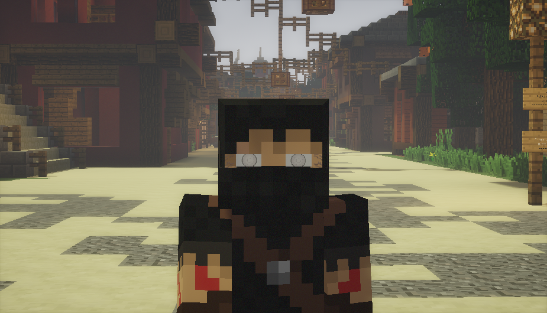
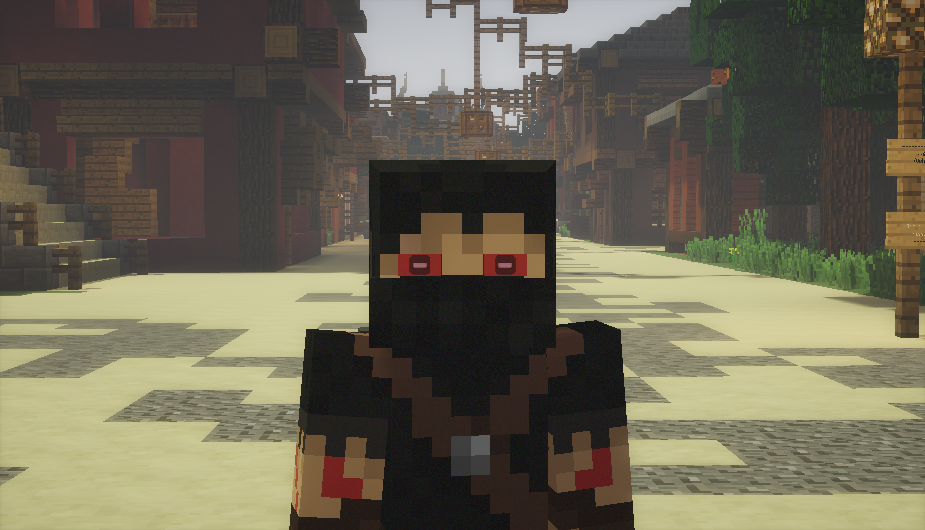
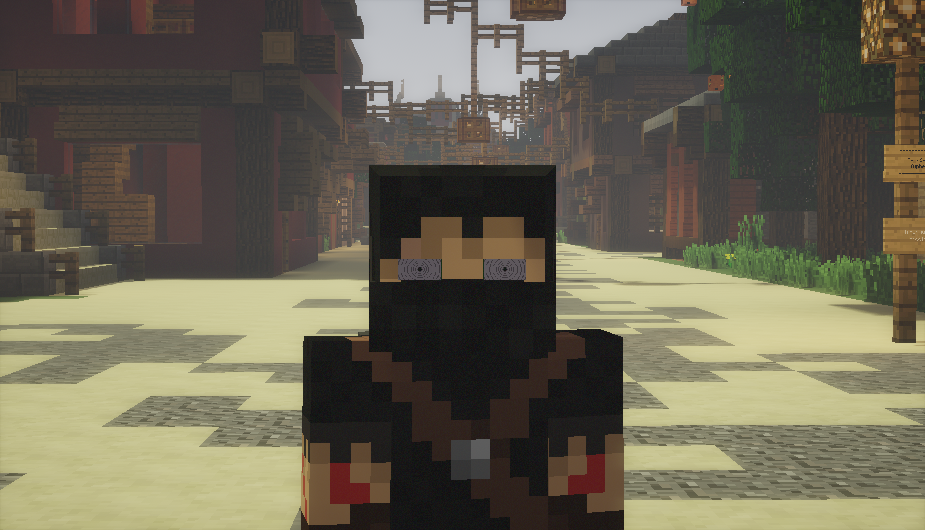
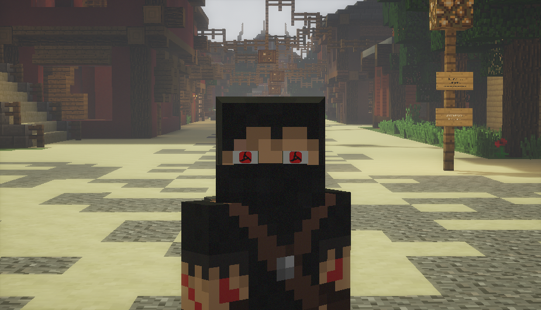

# NWMC
<h2>Dead core of my greatest projects. Literally spigot plugin collection with 20k+ lines of Magic config. <b>Without any mods. </b></h2>
<h3>You can use it by starting bat file I think. It should work.</h3>
<h3>There are a lot of jutsus and other epic naruto stuff.</h3>

    
    
    
    
    
    
    
    

